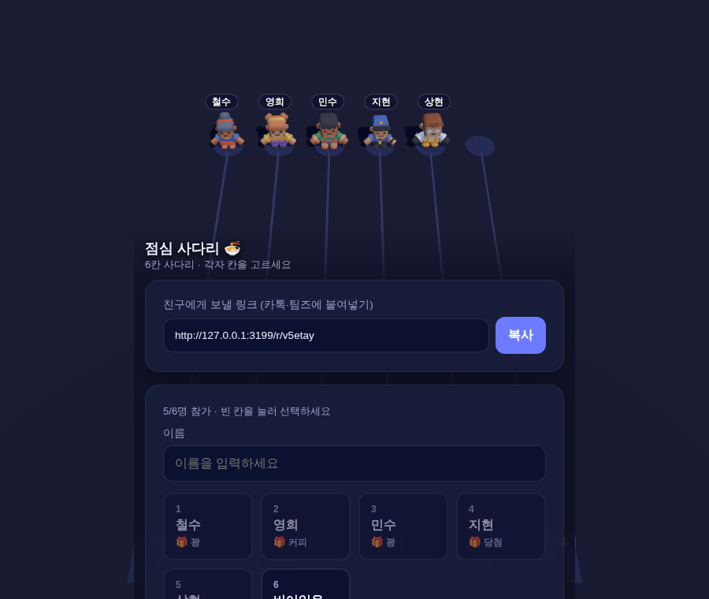
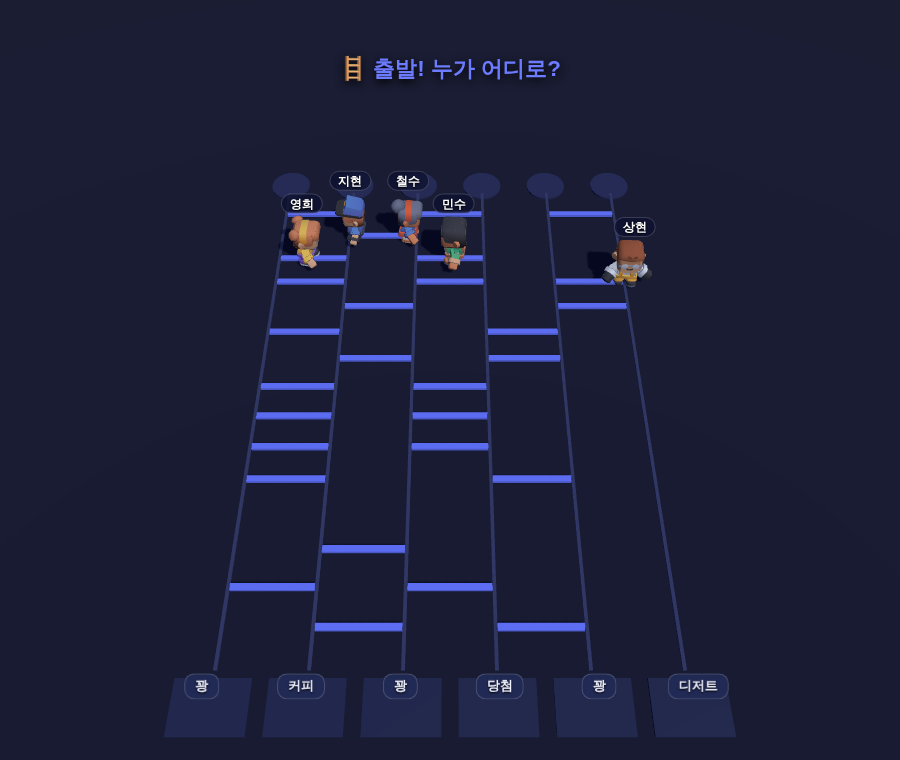

# 🪜 사다리타기 온라인 (Ladder Online)

여러 사람이 함께 즐기는 **온라인 사다리타기(Amidakuji)**. 방을 만들어 링크를
카톡·팀즈로 공유하면, 각자 자기 칸을 고르고, 방장이 시작하면 랜덤 사다리가
생성됩니다. **3D 캐릭터가 사다리를 타고 내려가** 각자의 결과(보상/벌칙)에 도착하는
연출을 함께 지켜봅니다.




## 무료 배포 (Render)

[](https://render.com/deploy?repo=https://github.com/jungrok5/ladder-online/tree/main)

위 버튼 → Render 로그인 → **Apply** 한 번이면 배포됩니다. `render.yaml`에
빌드/시작 명령이 정의돼 있어 추가 설정이 필요 없습니다. 배포 후
`https://ladder-online-xxxx.onrender.com` 주소로 방을 만들어 링크를 공유하세요.

> 무료(Free) 인스턴스는 15분간 접속이 없으면 잠들고, 첫 접속 시 약 30초
> 콜드스타트가 있습니다. 게임 중에는 폴링으로 계속 깨어 있어 문제없습니다.

## 특징

- **데이터베이스 없음** — 모든 방 상태는 서버 메모리에 저장(잠깐 즐기는 용도, 12시간 후 자동 삭제).
- **의존성 없음** — Node 내장 `http` 모듈만 사용. `node server.js` 로 바로 실행.
- **실시간 동기화** — WebSocket 대신 1.5초 폴링으로 모든 참가자 화면을 맞춤.
- **3D 연출** — Three.js + Kenney Mini Characters. WebGL 실패 시 자동으로 **2D SVG 연출로 폴백**.
- **공정한 사다리** — 인접 가로대를 금지해 경로가 항상 전단사(bijection)가 되도록 생성.

## 게임 흐름

1. 방장이 **칸 수(2~12)** 와 각 칸의 **결과(자유 입력)** 를 정해 방을 만든다.
2. 링크를 공유 → 참가자들이 **원하는 출발 칸을 직접 선택**한다.
3. 방장이 시작하면 랜덤 사다리가 생성되고, 캐릭터들이 내려가 결과에 도착한다.
4. 방장은 **다시 섞기**로 같은 멤버·같은 칸에 새 사다리를 굴릴 수 있다.

## 시작하기

```bash
npm start        # http://localhost:3000
```

환경 변수 `PORT` 로 포트를 바꿀 수 있습니다.

## 테스트

```bash
npm test         # 로직/HTTP 통합 테스트 (의존성 없음, Node 18+ 전역 fetch)
```

3D 무대 스모크(스크린샷 캡처)는 Playwright가 필요합니다(선택):

```bash
npm i playwright
PLAYWRIGHT_BROWSERS_PATH=/opt/pw-browsers node test/smoke.mjs   # docs/*.png 생성
```

## 구조

| 파일 | 설명 |
| --- | --- |
| `server.js` | 순수 Node HTTP 서버 — 라우팅·정적 서빙(gzip·캐시·MIME)·인메모리 룸 저장소·사다리 생성/경로 추적 |
| `public/index.html` | 방 생성 페이지 (칸 수·결과 입력) |
| `public/room.html` | 폴링 SPA — 로비(칸 선택)·연출 트리거·결과·2D 폴백 |
| `public/scene.js` | 3D 무대 (Three.js, 캐릭터 로딩·카메라 자동 프레이밍·사다리 하강 애니메이션) |
| `public/style.css` | 스타일 |
| `public/vendor/`, `public/assets/` | Three.js 모듈, Kenney 캐릭터 GLB (장기 캐시) |

## API

| 메서드 · 경로 | 설명 |
| --- | --- |
| `POST /api/rooms` | 방 생성 `{ title, laneCount, results[], laneMode, resultsHidden }` → `{ roomId, hostToken }` |
| `GET /api/rooms/:id` | 공개 상태. **시작 전에는 사다리/매핑을 노출하지 않음** |
| `POST /api/rooms/:id/join` | 참가 `{ name, lane? }` (pick: 칸 지정/자동, 점유 시 409) |
| `POST /api/rooms/:id/start` | 시작 `{ hostToken }` — 사다리 생성 + 매핑 계산, `revealing` 전이 |
| `POST /api/rooms/:id/finish` | 연출 종료 표시(멱등) — `finished` 전이 |
| `POST /api/rooms/:id/reset` | 로비로 복귀 `{ hostToken }` (pick 칸 유지) |

## 배포

`render.yaml` 로 Render 무료 플랜에 배포됩니다(`node server.js`, `autoDeploy`).

## 라이선스

MIT. 캐릭터 모델은 [Kenney Mini Characters](https://kenney.nl) (CC0) —
`public/assets/characters/LICENSE.txt` 참고.
